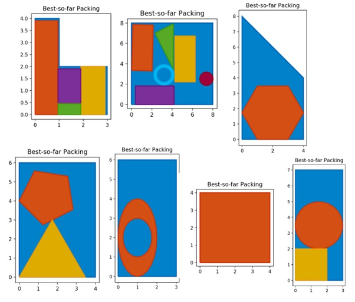
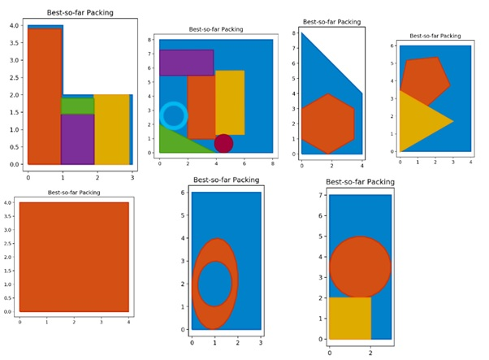

# EvolutionaryAlgorithms
Implementation of PSO and DEGL algorithms


## Summary

  - [Description of the problem](#description-of-the-problem)
  - [Description of the repository](#description-of-the-repository)
  - [Requirements](#requirements)
  - [Usage](#usage)
  - [Results](#results)
  - [Acknowledgments](#acknowledgments)

## Description of the problem
The cutting-stock problem is the problem of cutting standard-sized pieces of stock material, such as paper rolls or sheet metal, into pieces of specified sizes while minimizing material wasted. It is an optimization problem in mathematics that arises from applications in industry. More specifically we will deal with wood industry. Suppose a timber factory accepts orders to supply a certain number of pieces of wood. The aim is to make the best use of the current wood stock of the factory, so that the stock that remains after the removal of the pieces of the order can be used in the next order without the loss of a large area of wood. This practically means that the pieces of wood that remain after cutting must be as compact as possible. Hence, we consider a Two-Dimensional Cutting Stock Problem (2DCSP) where stock of different sizes is available, and a set of polygon items has to be obtained through three-stage guillotine cuts.

A set of wood belonging to the stock (Stock) and three orders (Order {01– 03}) are given. In the first phase, try to solve the three problems independently, that is, assuming that each time you have the same initial Stock. Then deal with the real problem, namely that the three orders come one after the other (in order Order01-> Order02-> Order03) and the Stock shrinks each time.

Two evolutionary algorithms will be compared to solve the problem: Particle swarm minimization algorithm with dynamic random neighborhood topology(PSO) and differential evolution DE with Global and Local neighborhood-based mutation operators(DEGL).

## Description of the repository
 
```
    .
    ├── pso.py                     # for PSO algorithm
    ├── DEGL.py                    # for DEGL algorithm
    ├── WoodProblemDefinition.py   # for the Stock and Orders definition
    ├── DynNeighborPSO.py          # a class that implements a simplified version of the particleswarm algorithm
    └── demo_shapely.py            # a demo for handling and plotting polygons
```

  
**Notes:** two solutions have been implemented, one is the FitOrderingStock1 function, where we have a much faster execution but with very little chance of error and the other is the FitOrderingStock function, where we have a reliable solution within Stock but with significantly slower execution. **Therefore, one has to choose in the code which of the above 2 functions will run.**


## Requirements
    python = 3.6.8
    numpy = 1.17.3
    matplotlib = 3.1.2
    shapely = 1.6.4
    
 
## Usage
For PSO run:
 
    python pso.py 
For DEGL run:

    python DEGL.py
    
## Results
### For PSO
Running the code with FitOrderingStock1 solution and with the option to rotate the polygons in orders, the following image is obtained:



### For DEGL
Running the code with FitOrderingStock1 solution and with the option to rotate the polygons in orders, the following image is obtained:



## Acknowledgments
https://en.wikipedia.org/wiki/Particle_swarm_optimization

https://en.wikipedia.org/wiki/Differential_evolution
